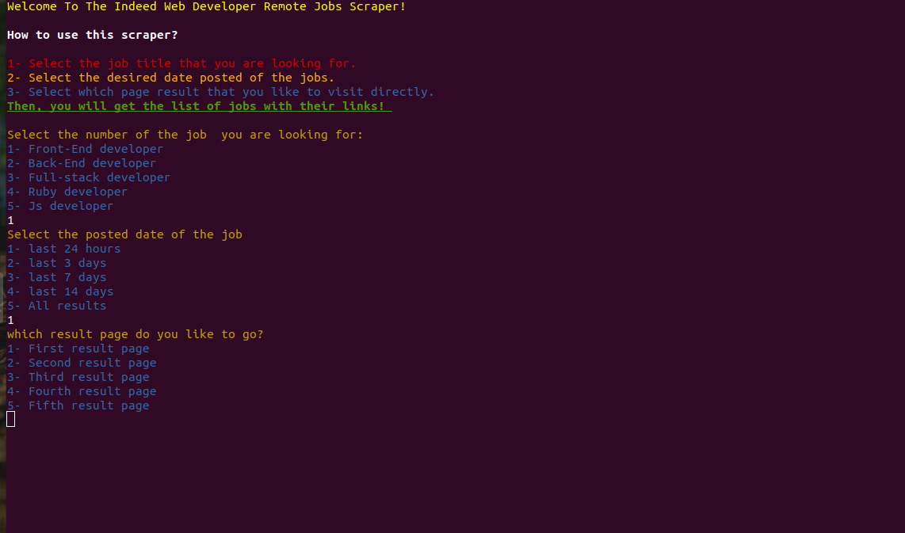
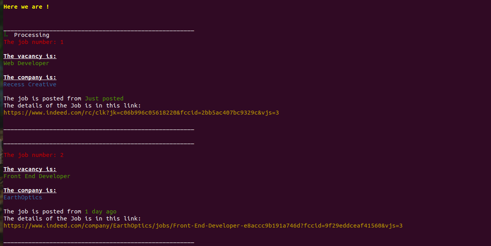

# indeed_web_scraper


**For this project I created a web scraper that returns a list of Web developer Jobs that are posted in [Indeed](https://www.indeed.com/). This will help newly graduated students from Microverse and other Job seekers to keep their eyes focus on posted jobs in an easy way.**

### I used in this application:
- Ruby.
- Ruby RSpec.
- Nokogiri Gem.
- HTTParty Gem.
- Rainbow Gem.
- Whirly Gem.

## How to use the application:

**Make sure Ruby is installed on your computer**

- Open The Terminal.
- Clone the project to your local machine:
```
git clone https://github.com/AhmedAmin90/indeed_web_scraper
```
- Install required Gems:

```
gem install RSpec 
gem install httparty 
gem install nokogiri
gem install rainbow
gem install whirly 
```
- To run the application: Go to The bin folder and open the terminal and run it by:
```
 ruby bin/main.rb
 ```

## The application screenshot :
**How to use the application**


- Select the job title that you are looking for. 
- Select the desired date posted of the jobs. 
- Select which page result that you like to visit directly. 
- Then, you will get the list of jobs with their links!.


**Options for searching**




**Start Proccessing data**


**List of Jobs:**





**End of list and link of the page**


# Author:

👤  Ahmed Amin

- Github: [@AhmedAmin90](https://github.com/AhmedAmin90)
- Twitter: [@AhmedAmin12383](https://twitter.com/AhmedAmin12383)
- LinkedIn: [AhmedAmin](https://www.linkedin.com/in/web-developer)

## Show your support

Give a ⭐️ if you like this project!

## Acknowledgments

- Microverse


## 📝 License

This project is [MIT](LICENSE) licensed.
